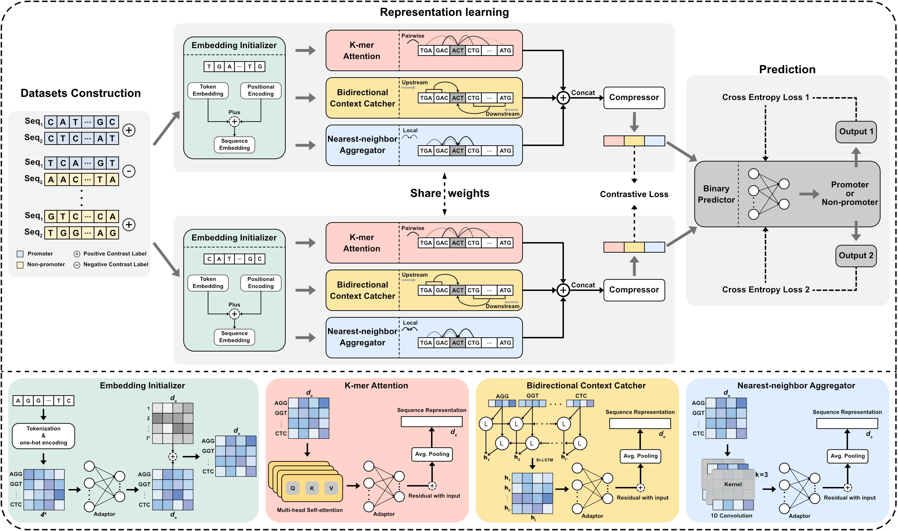

<div align="center">

# 🧬 SiamProm

**Cyanobacterial promoter identification with Siamese network-based contrastive learning**

[](https://colab.research.google.com/github/Passion4ever/SiamProm/blob/main/notebooks/SiamProm_Colab.ipynb) [](https://doi.org/10.1093/bib/bbae193) [](LICENSE)



Novel non-promoter generation · Siamese contrastive learning

</div>

## Usage

### Google Colab

[](https://colab.research.google.com/github/Passion4ever/SiamProm/blob/main/notebooks/SiamProm_Colab.ipynb)

Predict promoters from pasted or uploaded 81 bp sequences on a free Colab GPU, no installation needed.

### Local

#### Environment

```bash
conda env create -f env_SiamProm.yaml
conda activate SiamProm
```

#### Inference

```bash
python predict.py --checkpoint weights/siamprom_phantom.pth --fasta seqs.fasta --output results.csv
```

<details>
<summary>Arguments</summary>

| Argument | Description | Default |
| -------------- | --------------------------------- | ------- |
| `--checkpoint` | Model checkpoint path | — |
| `--fasta` | Input FASTA file (81bp sequences) | — |
| `--output` | Output CSV path | — |
| `--device` | `cpu` or GPU index | 0 |
| `--batch-size` | Batch size | 256 |
| `--threshold` | Classification threshold | 0.5 |

The output CSV contains columns: `name`, `sequence`, `prediction`, `confidence`.

</details>

#### Train from scratch

```bash
python train.py sampling=phantom
```

<details>
<summary>Options</summary>

Optional values for the parameter `sampling` are `phantom`(default), `random`, `cds`, and `partial`.

For more detailed instructions on parameter management and configuration usage, please refer to the [Hydra](https://hydra.cc/docs/1.3/intro/) documentation.

</details>

## Citation

```bibtex
@article{yang2024recognition,
  title   = {Recognition of cyanobacteria promoters via Siamese network-based contrastive learning under novel non-promoter generation},
  author  = {Yang, Guang and Li, Jianing and Hu, Jinlu and Shi, Jian-Yu},
  journal = {Briefings in Bioinformatics},
  volume  = {25},
  number  = {3},
  pages   = {bbae193},
  year    = {2024},
  doi     = {10.1093/bib/bbae193},
}
```
